# Sentra Security Platform

Sentra is an agentic AI security platform that finds vulnerabilities in real code, explains them in plain language, generates an actual fix, and opens a real pull request, all without a single line of your source code ever leaving your machine.

It scans with Semgrep, reasons and writes fixes with a locally hosted Gemma model running through Ollama, and verifies every fix it generates before a human ever sees it. Built for a world where more code is written by AI, and reviewed by humans, than ever before.

This repo is a showcase: real screenshots of the running product, real data, real fixes. The full source lives in a private repository as this is an active Final Year Project.

## What it actually does

1. **Scan** — Semgrep-based static analysis across a project, local folder or connected GitHub repo, catching real vulnerability classes: SQL injection, command injection, hardcoded secrets, path traversal, weak cryptography, and more.
2. **Analyze** — a local Gemma model explains each finding in plain language: what it is, why it matters, what exploiting it would look like.
3. **Fix** — the same model writes an actual patch for that specific finding.
4. **Validate** — every generated fix is checked for syntax validity, real variable/function scope correctness, whether it actually changed anything, and re-scanned with the original rule to confirm the vulnerability is genuinely gone. A failing fix is retried automatically, up to three times, with the specific failure fed back to the model.
5. **Review & publish** — a developer accepts, rejects, or dismisses each finding from the dashboard, then Sentra commits the accepted fixes and opens a real GitHub pull request.

Nothing about the AI's output is trusted blindly. That verification pipeline is the real core of the project, not the dashboard around it.

## Screenshots

### Security overview
The dashboard's home page: total projects, scans, findings by severity, a live findings trend, and recent activity across every connected repo.

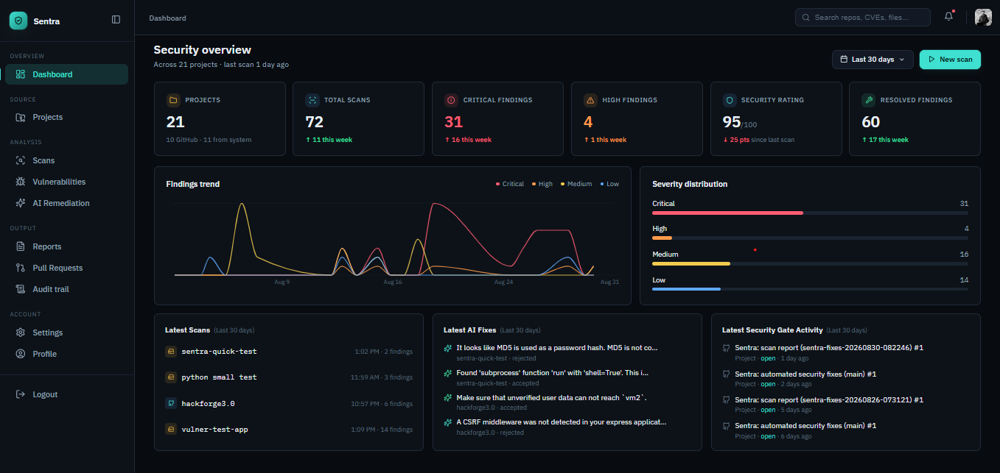

### Vulnerabilities
Every finding across every project, with real CWE and OWASP category mapping, severity, confidence, and fix status, filterable and exportable.

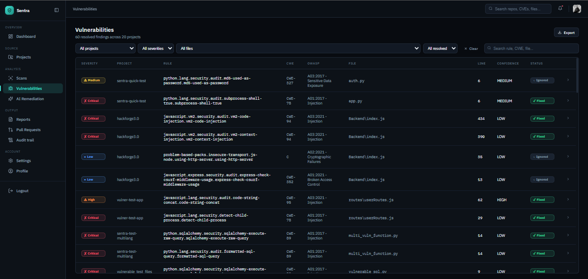

### Vulnerability detail, with the AI's actual fix
Click into any finding and see the vulnerable code, the AI's explanation of why it's dangerous, its real-world impact, and the exact patch it generated, side by side with the original.

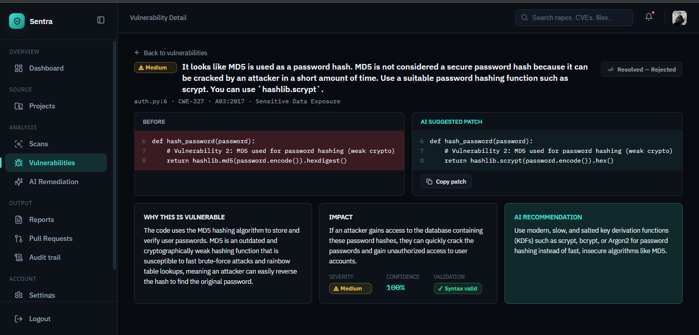

### Live scan pipeline
Watch a scan move through every real stage, Scan, Analyze, Generate Fix, Validate, Present, with a live log and findings appearing as they're discovered.

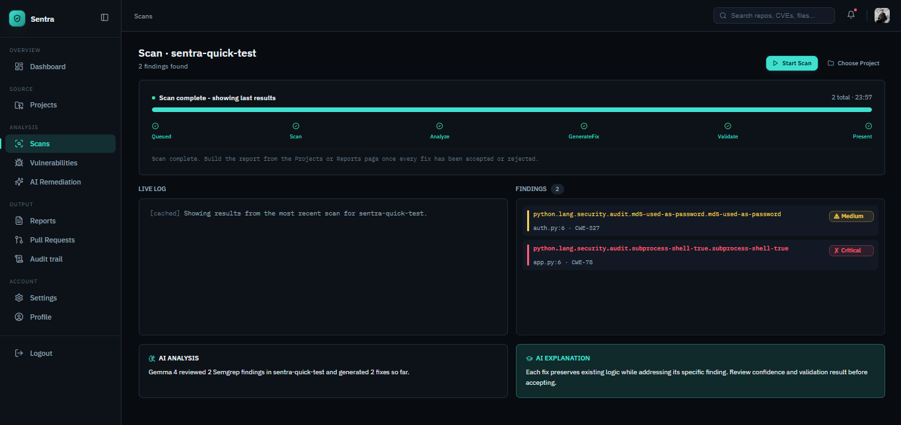

### AI Remediation queue
Every AI-generated fix waiting on a decision, with a real confidence score and quality rating per fix, across every project.

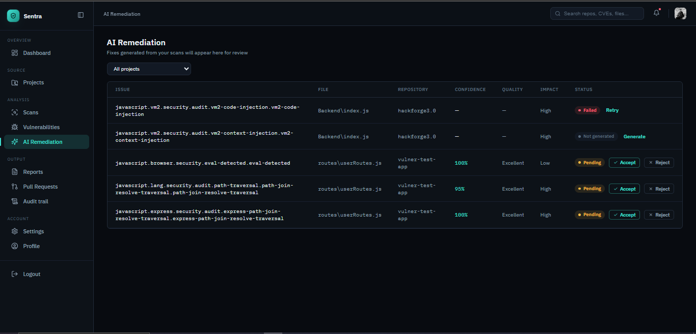

### A second real fix, explained
A different vulnerability class (unsafe `eval()` use), same treatment: before/after code, why it's dangerous, what it impacts, and what to do instead.

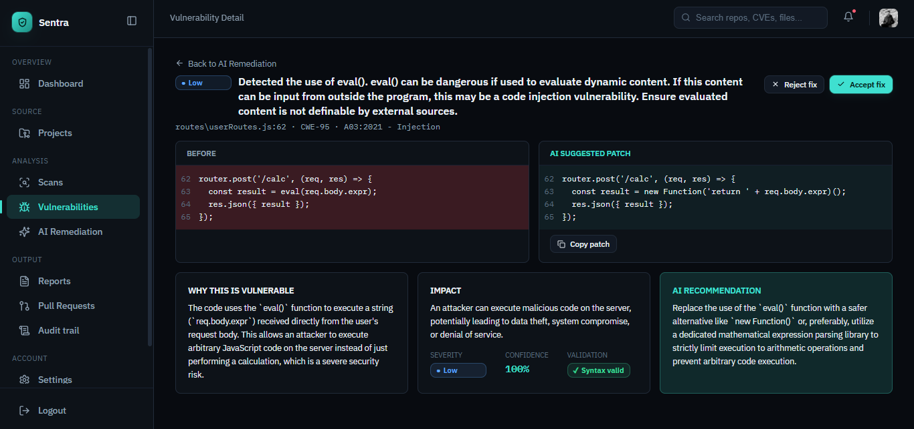

### Projects
Every project Sentra watches, local or GitHub-connected, with its language, branch, last scan, and one-click actions to scan, generate fixes, or push a fix as a pull request.

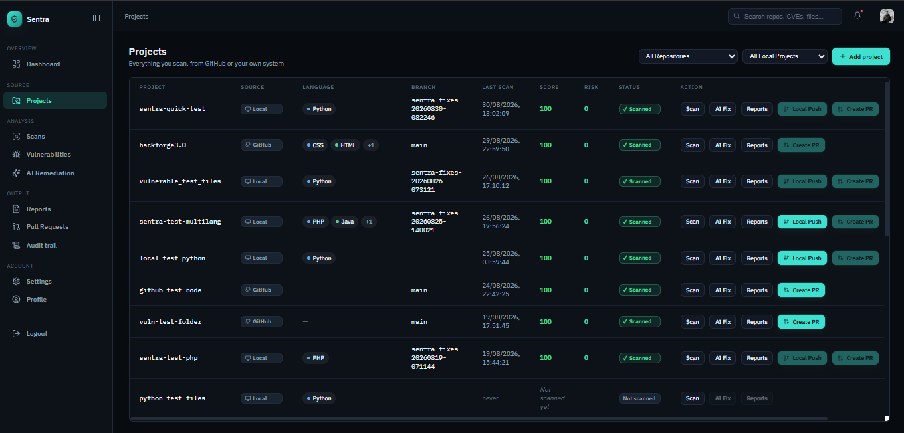

### Pull requests, tracked end to end
Every PR Sentra has opened, with its real CI status and merge state pulled live from GitHub, not just "created and forgotten."

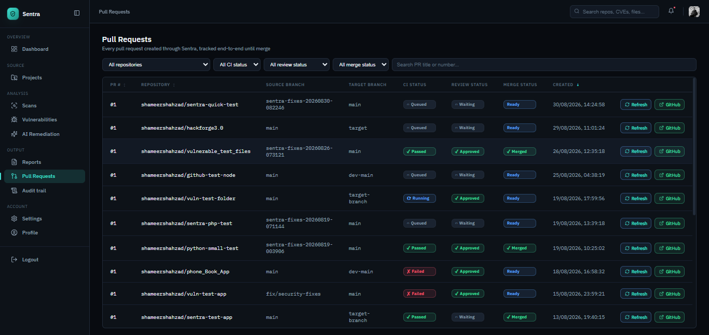

### Reports
Per-project, per-scan security reports, ready to export as PDF, HTML, CSV, or JSON.

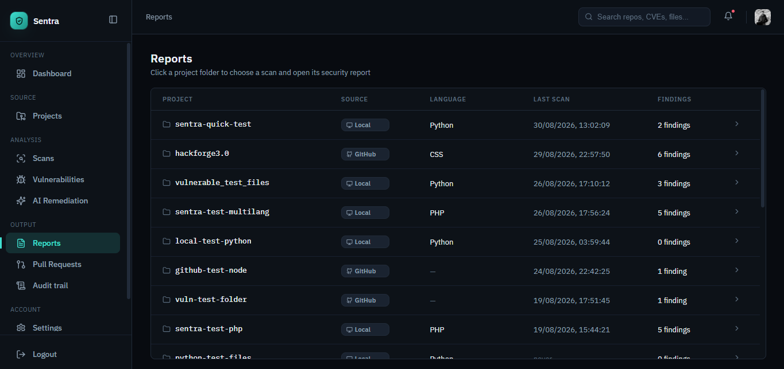

A real generated report: security score climbing 40 → 100 after 3 critical findings (SQL injection, command injection across PHP and Java) were all fixed, with the full before/after trend and finding-by-finding breakdown.

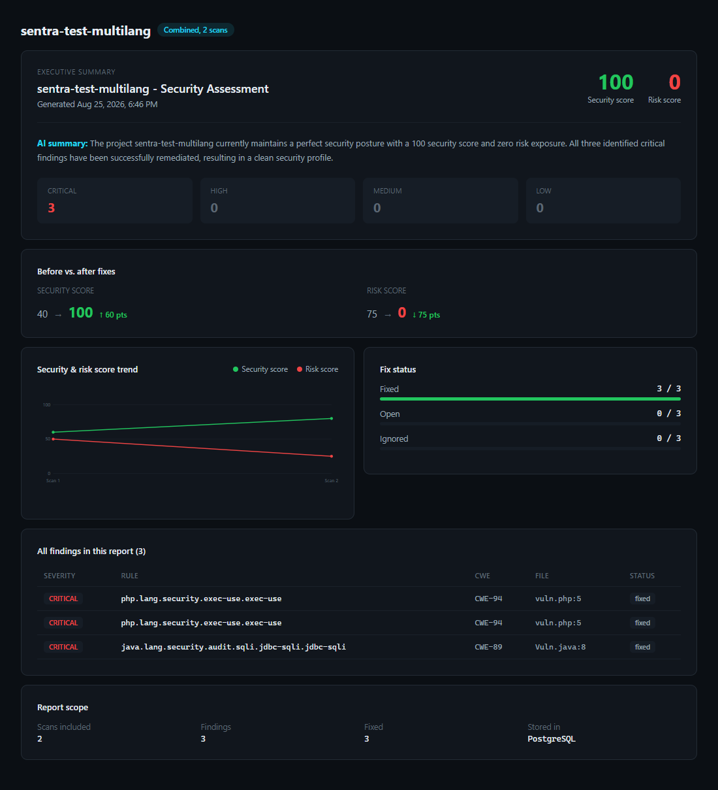

### Audit trail
An append-only log of every action taken on the account. Nothing here can be edited or deleted after the fact, by design.

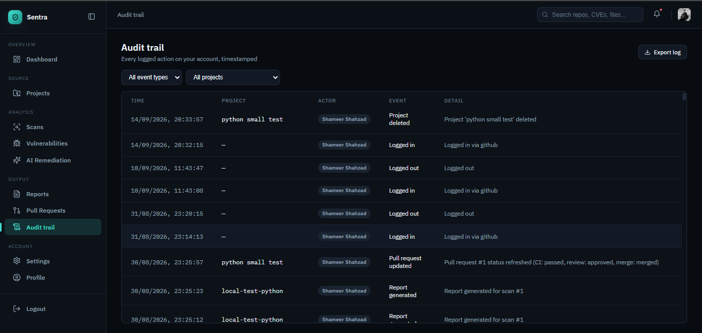

### VS Code extension — the same pipeline, without leaving your editor

Sentra isn't only a dashboard. A companion VS Code extension runs the same detect → explain → fix → verify pipeline inline, so a developer can catch and fix a vulnerability without ever opening a browser.

**Detects it for real** — a genuine command-injection vulnerability (CWE-78), found with the same Semgrep engine the backend uses.

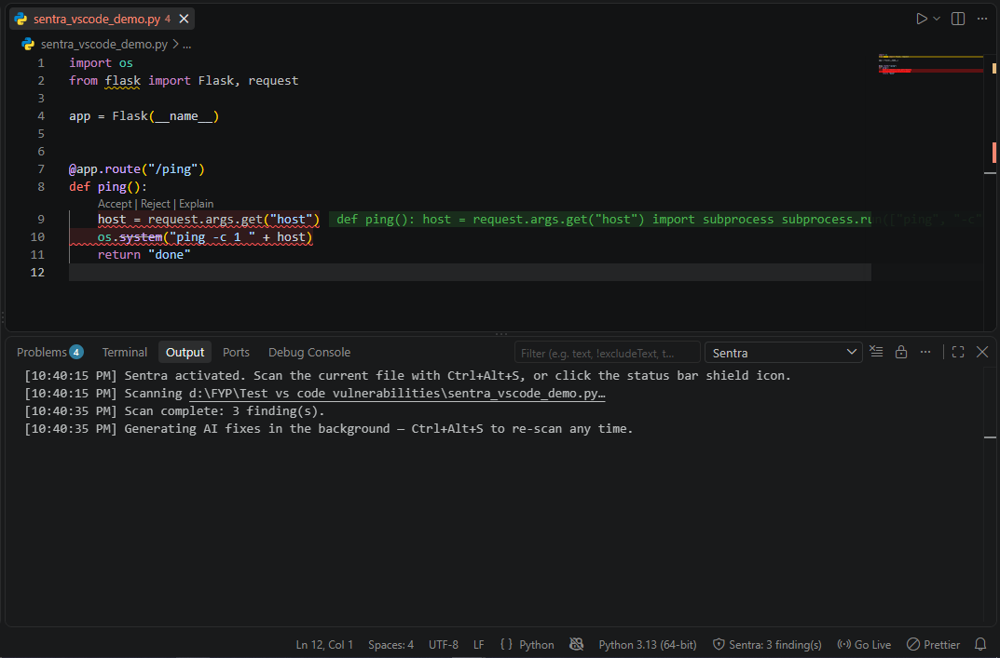

**Explains it in plain language** — right where the code lives: why it's dangerous, and what accepting the fix will actually change.

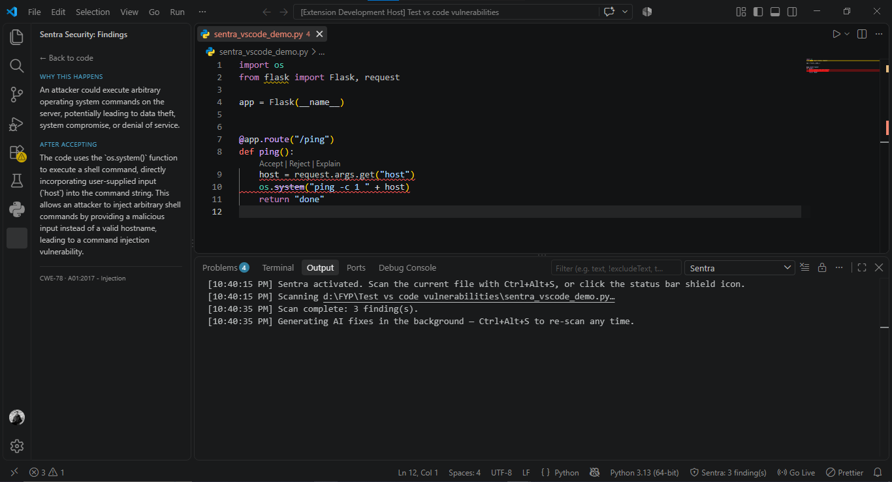

**Fixes it, and proves the fix worked** — one click replaces the vulnerable `os.system()` call with a safe `subprocess.run()` call, and an immediate re-scan reports zero findings. Not "trust me" — a second, independent scan.

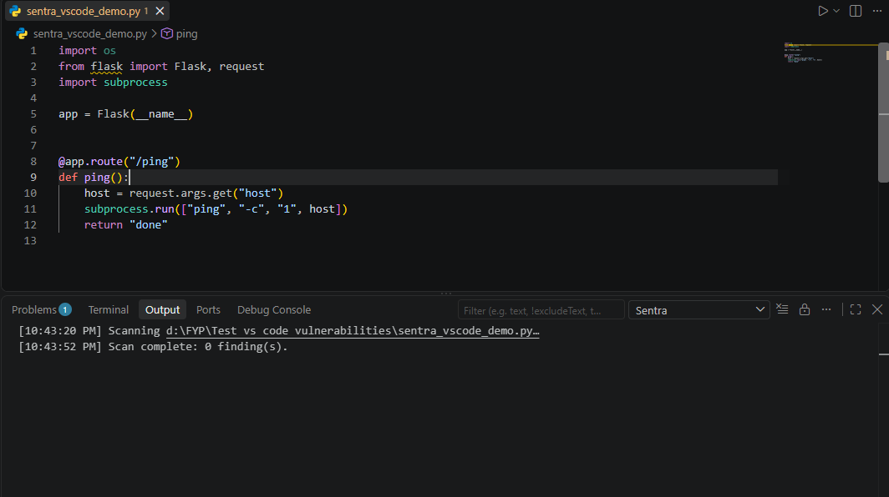

## Why it's built this way

Cloud AI code-review tools can explain and fix vulnerabilities, but only by sending your source code to someone else's server, a non-starter for regulated industries, proprietary code, or anyone who just doesn't want to. Sentra runs the whole pipeline, scanning and the LLM both, entirely on the local machine.

The harder problem, and the actual point of this project, is that a local LLM will confidently hand back a fix that looks right but doesn't compile, references a variable that doesn't exist, or quietly leaves the vulnerable code untouched while claiming success. Sentra's validation layer exists specifically to catch that, and it's been hardened against real, reproduced failure cases, not just theoretical ones.

## Stack

- **Backend** — FastAPI, PostgreSQL, SQLAlchemy, LangGraph for pipeline orchestration
- **Frontend** — React, Vite
- **AI** — Ollama running Gemma, through a custom MCP-style tool layer (Scan / Analyze / Fix / Validate)
- **Scanning** — Semgrep
- **Also included** — a companion VS Code extension for inline, learning-focused review (see screenshots above)

## Status

Actively developed as a Final Year Project. The scan, analyze, fix, and validate pipeline is complete and has been tested end to end against real code, real vulnerabilities, and a real running model, not mocked components.
